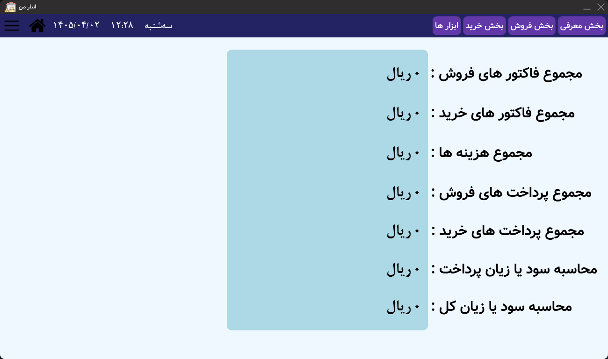

# Anbar

### Warehouse Management System built with WPF & Sqlite

A desktop warehouse management application developed using C#, WPF and Sqlite for Win 7 or higher (.NETFramework 4.7.1).

Designed to manage products, purchases, sales, inventory, expenses and financial reports through a modern desktop interface.

 

---

# 📷 Screenshots

## Login Page

  

---

## Dashboard

  

---

# ✨ Features

✅ Product Management

✅ Purchase Management

✅ Sales Management

✅ Inventory Tracking

✅ Expense Tracking

✅ Profit & Loss Calculation

✅ Custom User Controls

✅ Modern WPF User Interface

✅ User Authentication

✅ Application Settings

---

# 🔐 Default Login

When running the application for the first time, use the following credentials:

| Username | Password |
| -------- | -------- |
| 1        | 1        |

After logging in, you can change both username and password from inside the application.

---

# 🛠 Technologies

| Description               | Technology         |
| ------------------------- | ------------------ |
| Main programming language | C#                 |
| Desktop UI Framework      | WPF                |
| Database                  | Sqlite             |
| User Interface Design     | XAML               |
| Database Communication    | ADO.NET            |
| Development Environment   | Visual Studio 2022 |

